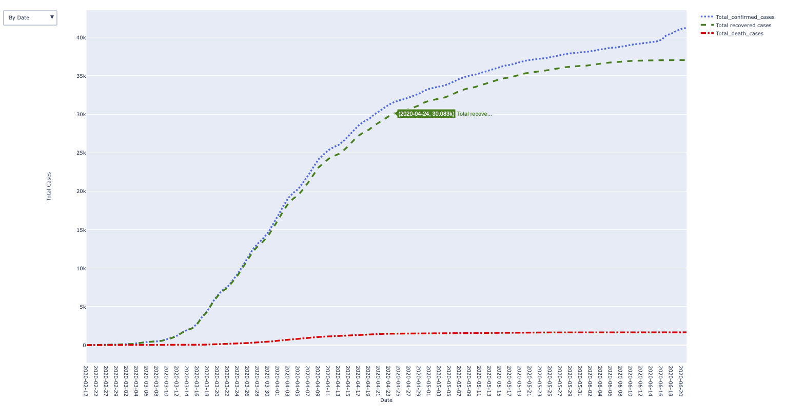
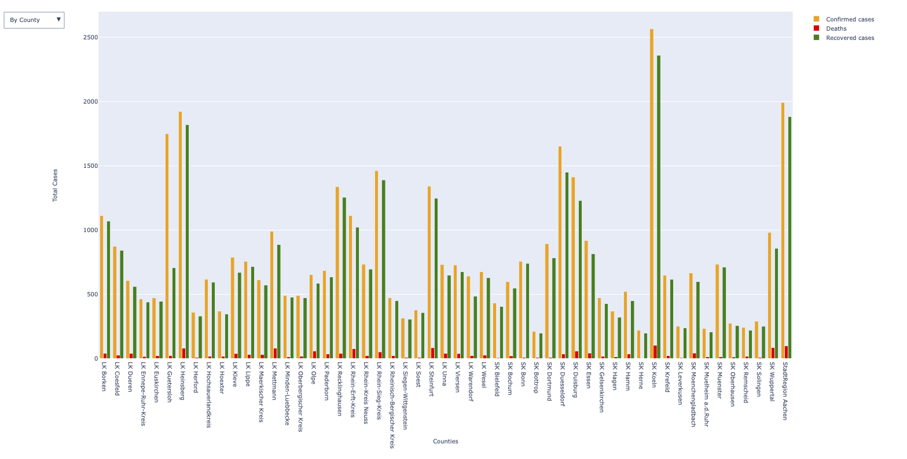
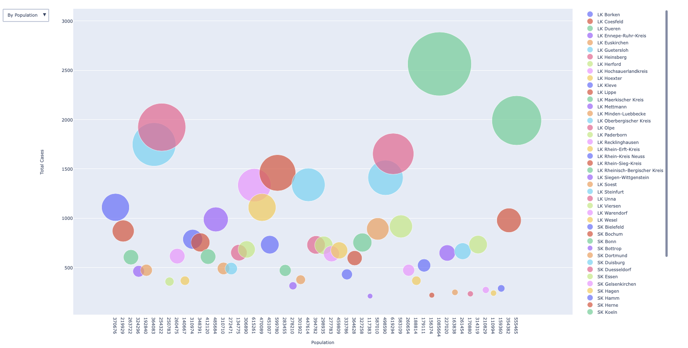
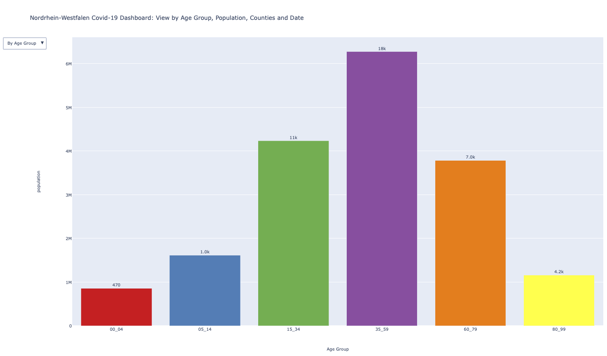

# Covid-19 Visualization of NRW - Germany
IDV-Mini Project

**DAILY STATUS**

**COUNTY STATUS**

**POPULATION WISE SPREAD**

**AGE WISE SPREAD**

------

Copyright (c) 2020 Abdul Ahad Ayaz, Sayalee Chavan, Suganthi Jaganathan, Bhagyashree Sanjay Borade

